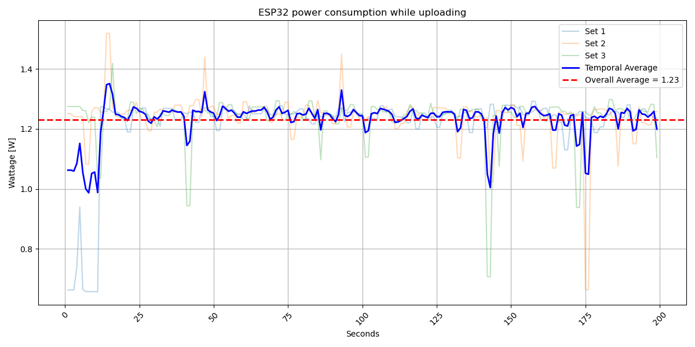
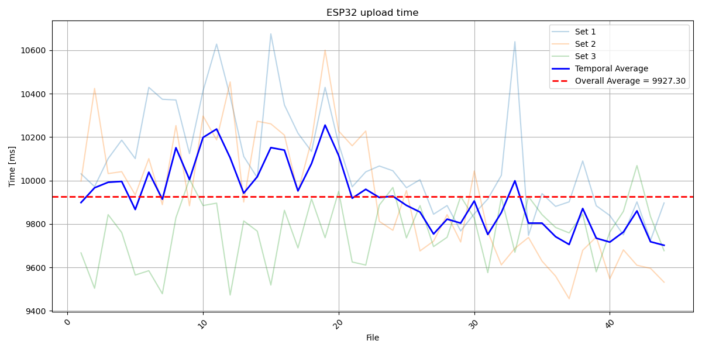

> [!NOTE]
> This folder contains the raw measurements for the ESP32 LyraT v4.3
  
> [Source](https://www.heise.de/news/ESP32-LyraT-V4-3-Soundmodul-mit-ESP32-4906420.html)
## Test setup
### Recording
The ESP32 was connected to a Powerbank through a Ruideng AT34 Power Meter.
The device was set to only record and save the files on the SD Card.
During the recording time a camera was recording the power meter.

### Sending
The ESP32 was again connected to a Powerbank through the Ruideng AT34 Power Meter.
Test files were loaded on the sdcard of the ESP beforehand and the device was set to only send those files.

> [!WARNING]
> The files used for this test were LARGER than the ones the ESP would natively record.
> The ESP records wav files that are around 3.7MB in size, while 7.2MB large files were used for the test runs!

## Results
### Recording
> [!NOTE]
> More granular results can be found in the README of [Run 1](record/1/README.md), [Run 2](record/2/README.md), and [Run 3](record/3/README.md)  

### Sending
> [!NOTE]
> More granular results can be found in the README of [Run 1](send/1/README.md), [Run 2](send/2/README.md), and [Run 3](send/3/README.md)  

