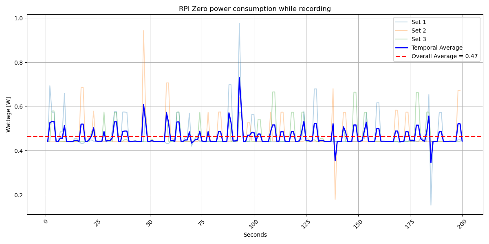
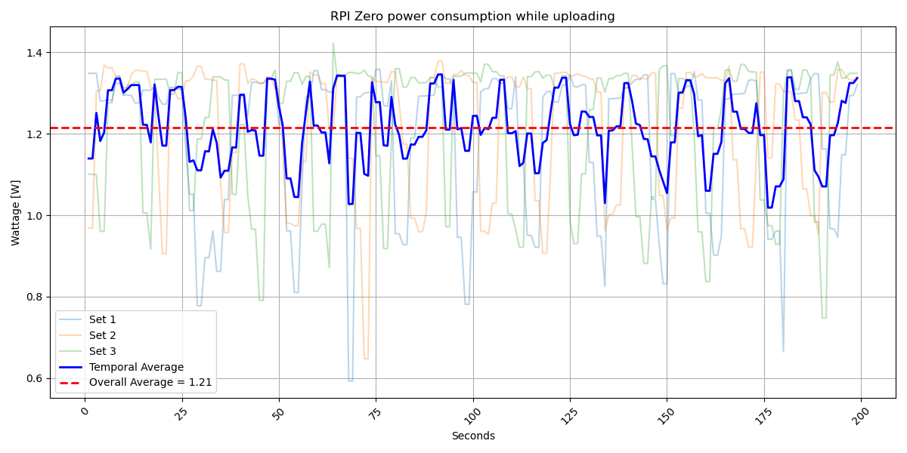

> [!NOTE]
> This folder contains the raw measurements for the RPI Zero W
  
> [Source](https://www.rasppishop.de/IQaudio-Codec-Zero-fuer-Raspberry-Pi-ZERO-W-WH)
## Test setup
### Recording
The Raspberry Pi Zero W was connected to a Powerbank through a Ruideng AT34 Power Meter.
`arecord` was used to record wav files using the IQaudIO HAT.
During the recording time a camera was recording the power meter.

### Sending
The Raspberry Pi Zero W was again connected to a Powerbank through the Ruideng AT34 Power Meter.
Test files were sent to the Pi using ssh and the server software started to send the files.

## Results
### Recording
> [!NOTE]
> More granular results can be found in the README of [Run 1](record/1/README.md), [Run 2](record/2/README.md), and [Run 3](record/3/README.md)  

### Sending
> [!NOTE]
> More granular results can be found in the README of [Run 1](send/1/README.md), [Run 2](send/2/README.md), and [Run 3](send/3/README.md)  

